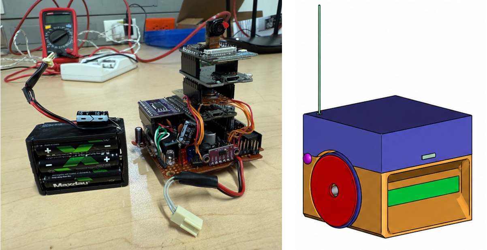
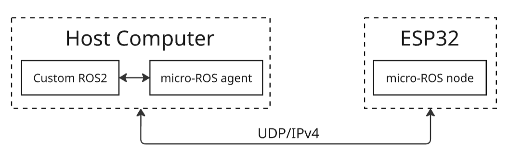

# Differential Robot FIRA - ROS 2/micro-ROS Retrofitting Architecture

<p align="center">
  
</p>

<p align="center">
  
  
  
  
  
  
  <a href="LICENSE.txt"></a>
</p>

---

## Table of Contents

1. [Introduction](#introduction)
2. [Video](#video)
3. [Upgrade Overview](#upgrade-overview)
4. [Repository Structure](#repository-structure)
5. [Setup](#setup)
6. [Requirements](#requirements)
7. [Hardware Components](#hardware-components)
8. [System Integration](#system-integration)
9. [micro-ROS Architecture](#micro-ros-architecture)
10. [Run the Robot](#run-the-robot)
11. [Improvements](#improvements)
12. [Future Work](#future-work)
13. [Technologies Used](#technologies-used)
14. [Contact](#contact)
15. [Citation](#citation)
16. [License](#license)

---

## Introduction

This repository documents the electronic and software upgrade of a legacy FIRA differential-drive robot originally designed for small-size robot soccer competitions. The original platform followed a remote-brainless architecture, where perception, decision-making, and control were performed by external infrastructure, while the robot mainly received wireless motion commands.

The objective of this project is not to design a new robot from scratch, nor to present a final autonomous navigation platform. Instead, the project proposes a retrofitting architecture that preserves the original mechanical structure while replacing obsolete electronics, communication interfaces, and software with a modular ROS 2/micro-ROS-compatible embedded system.

The upgraded platform integrates ESP32, ESP32-CAM, onboard sensing, motor control, Bluetooth/Wi-Fi communication, micro-ROS, ROS 2 host-side nodes, teleoperation, camera visualization, and expandable hardware interfaces. This makes the legacy robot usable again as a compact educational and research-oriented mobile robotics platform.

> **Note**  
> This repository should be treated as a prototype-level technical reference. The current implementation demonstrates the retrofitting architecture and functional integration of the main hardware and software components. It is not presented as a final PCB implementation, a fully autonomous robot, or a complete SLAM/navigation platform.

---

## Video

The following video provides a short visual overview of the upgraded FIRA differential robot prototype.


https://github.com/user-attachments/assets/053389d7-12a1-44e7-9ee8-c520436eb5fc


---

## Upgrade Overview

The upgrade transforms the legacy FIRA robot from a centralized RF/vision-dependent platform into a ROS 2-enabled embedded robotic system. The main idea is to reuse the mechanically functional base while modernizing the layers that limit current use: sensing, embedded control, communication, and software integration.

Main upgraded capabilities include:

- **Preserved mechanical base:** original chassis, wheels, motors, and differential-drive structure.
- **Embedded control:** ESP32-based sensing, actuation, mode selection, and micro-ROS communication.
- **Onboard camera:** ESP32-CAM for HTTP/MJPEG video streaming.
- **Onboard sensing:** IMU, time-of-flight distance sensors, voltage/current monitoring, and encoder-based motion information.
- **Dual communication mode:** Bluetooth for direct/manual testing and Wi-Fi/micro-ROS for ROS 2 integration.
- **ROS 2 software architecture:** node-based structure for motor control, sensors, encoders, actuators, camera visualization, and teleoperation.
- **Expandable hardware:** GPIO, I2C, UART, PWM, power, and ground interfaces for future sensors or actuators.

The contribution of this repository is the documented transition from a legacy remote-brainless robot soccer platform to a modular embedded ROS 2/micro-ROS-compatible platform for education, research, and future multi-robot experiments.

---

## Repository Structure

The repository is organized as follows:

```text
.
├── ESP32CAMcode/              # ESP32-CAM firmware for onboard video streaming and auxiliary wireless functions
├── ESP32code/                 # Main ESP32 firmware for sensors, motors, actuators, and micro-ROS communication
├── Images/                    # Robot images, diagrams, visual assets, and contact icons
│   ├── Electronic_Update.png  # Main README image of the upgraded robot
│   ├── microROSagent.png      # micro-ROS communication architecture diagram
│   ├── Email.png              # Contact icon
│   ├── GoogleScholar.png      # Contact icon
│   ├── LinkedIn.png           # Contact icon
│   └── ORCID.png              # Contact icon
├── Camera_Username.pdf        # Reference manual for the original Samsung legacy camera
├── Mechanical_assembly.f3z    # Fusion 360 mechanical assembly file
├── Robot_FIRA_Username.pdf    # Legacy FIRA/YSR-A robot platform user manual
├── Upgrade_File.pdf           # Technical report or upgrade documentation
├── ros2_ws.zip                # ROS 2 workspace with host-side nodes and launch files
├── LICENSE.txt                # Apache-2.0 license
└── README.md                  # Main project documentation
```
---

## Setup

### Clone the repository

```bash
git clone https://github.com/LefferTrochez/Differential-Robot-FIRA.git
cd Differential-Robot-FIRA
```

### Extract the ROS 2 workspace

The ROS 2 workspace is included directly in the repository as:

```text
ros2_ws.zip
```

Extract it in your preferred development directory. For example:

```bash
unzip ros2_ws.zip -d ros2_ws
cd ros2_ws
```

Then build the workspace:

```bash
colcon build --symlink-install
source install/setup.bash
```

To make the workspace available in every new terminal, add the setup command to your `.bashrc`:

```bash
echo "source ~/ros2_ws/install/setup.bash" >> ~/.bashrc
source ~/.bashrc
```

> **Important**  
> Adjust the workspace path depending on where you extracted `ros2_ws.zip`.

---

## Requirements

The prototype was developed and tested using the following environment:

- Ubuntu 22.04 LTS
- ROS 2 Humble Hawksbill
- Python 3.10
- Arduino IDE 2.3.4
- ESP32 Arduino Core 2.0.2
- micro-ROS Arduino library for ROS 2 Humble
- micro-ROS Agent for ROS 2 Humble
- OpenCV 4.8 or later
- NumPy 1.24 or later
- ESP32 development board
- ESP32-CAM AI Thinker module

Arduino libraries used by the embedded firmware:

- Adafruit MPU6050 2.2.6
- Adafruit BusIO 1.16.1
- Adafruit Unified Sensor 1.1.14
- Adafruit INA219 1.2.3
- VL53L0X by Pololu 1.3.1
- ESP32Servo 3.0.5
- DabbleESP32 1.5.1
- micro_ros_arduino Humble branch

> **Note**  
> The listed versions correspond to the development environment used for this prototype. Newer versions may work, but they were not systematically tested.

### ESP32 board support

In the Arduino IDE, add the ESP32 board manager URL:

```text
https://raw.githubusercontent.com/espressif/arduino-esp32/gh-pages/package_esp32_index.json
```

Then install the ESP32 board package from the Boards Manager.

### ESP32-CAM configuration

For the ESP32-CAM firmware, select the AI Thinker board and define the camera model as:

```cpp
#define CAMERA_MODEL_AI_THINKER
```

---

## Hardware Components

The upgraded robot integrates the following main components:

- **ESP32:** main embedded controller for sensors, motors, actuators, mode selection, and micro-ROS communication.
- **ESP32-CAM:** onboard camera module for HTTP/MJPEG video streaming.
- **TB6612FNG dual motor driver:** motor driver for independent control of the left and right motors.
- **Faulhaber MOTOR 2224U006SR motors:** original differential-drive motors with encoders.
- **MPU6050:** inertial measurement unit for motion-related measurements.
- **VL53L0X sensors:** time-of-flight distance sensors for local range measurements.
- **TCA9548A I2C multiplexer:** I2C expansion for multiple sensors with similar addressing.
- **INA219:** voltage and current sensing for power monitoring.
- **LEDs, buzzer, and push button:** user interface for mode selection and status feedback.
- **2S battery and voltage regulation:** power supply for embedded electronics and motor actuation.
- **Expansion headers:** GPIO, I2C, UART, PWM, power, and ground interfaces for future modules.

---

## System Integration

The upgraded FIRA robot is organized around a modular hardware/software architecture. The ESP32 acts as the main embedded controller, handling sensor acquisition, motor commands, actuator signals, mode selection, and micro-ROS communication. The ESP32-CAM provides the onboard video interface and supports camera streaming over Wi-Fi.

The robot supports two complementary operation modes. Bluetooth mode allows direct manual testing and basic hardware validation without launching the complete ROS 2 stack. Wi-Fi mode enables integration with ROS 2 through micro-ROS, allowing the ESP32 to exchange sensor readings, motor commands, actuator states, and monitoring information with ROS 2 nodes running on the host computer.

On the host side, the ROS 2 package is organized into independent nodes for motor command processing, sensor aggregation, encoder processing, actuator routing, camera visualization, and teleoperation. This avoids a monolithic software structure and makes the platform easier to maintain, extend, and reuse.

---

## micro-ROS Architecture

<p align="center">
  
</p>

micro-ROS brings ROS 2 concepts to resource-constrained microcontrollers such as the ESP32. In this project, the ESP32 runs a micro-ROS client and communicates with a micro-ROS Agent running on the ROS 2 host computer. The agent bridges the embedded device with the ROS 2 network using UDP4 communication.

This architecture allows the robot to publish sensor information and receive motor or actuator commands using ROS 2 topics, enabling integration with modern teleoperation, visualization, logging, and future autonomous behavior modules.

### micro-ROS installation instructions

Install the micro-ROS Arduino library:

```bash
git clone https://github.com/micro-ROS/micro_ros_arduino.git -b humble
```

Then add the library to the Arduino IDE as a ZIP library or copy it to your Arduino libraries folder.

Create and build the micro-ROS Agent inside the ROS 2 workspace:

```bash
cd ~/ros2_ws/src/
git clone https://github.com/micro-ROS/micro-ROS-Agent.git -b humble
cd ..
rosdep install --from-paths src --ignore-src -r -y
colcon build --symlink-install
source install/setup.bash
```

Start the micro-ROS Agent:

```bash
ros2 run micro_ros_agent micro_ros_agent udp4 --port 8888
```

---

## Run the Robot

After flashing the ESP32 and ESP32-CAM firmware and starting the robot, run the ROS 2 nodes from the host computer.

```bash
# Terminal 1
source ~/ros2_ws/install/setup.bash
ros2 run micro_ros_agent micro_ros_agent udp4 --port 8888
```

```bash
# Terminal 2
source ~/ros2_ws/install/setup.bash
ros2 launch robot_fira launch_nodes.launch.py
```

```bash
# Terminal 3
source ~/ros2_ws/install/setup.bash
ros2 run robot_fira teleop_node.py
```

> **Note**  
> Node names, launch file names, and package names should be adjusted if they differ in the extracted `ros2_ws` workspace.

---

## Improvements

The upgraded prototype introduces several improvements over the original legacy robot soccer platform:

- Replacement of RF-only command reception with Bluetooth and Wi-Fi communication.
- Integration of ESP32 and ESP32-CAM modules.
- Addition of onboard sensing for inertial, distance, and power-related measurements.
- Integration of motor control through a modern dual motor driver.
- Camera streaming without depending on the original overhead CCD camera and frame grabber.
- ROS 2/micro-ROS communication through a topic-based architecture.
- Modular host-side software nodes for teleoperation, sensors, motors, encoders, actuators, and camera visualization.
- Expansion interfaces for future sensors, actuators, and navigation modules.

---

## Future Work

Future versions of this project will focus on improving both hardware robustness and software capabilities. Planned work includes:

- Designing and manufacturing a custom PCB.
- Improving wiring, mechanical mounting, and long-term robustness.
- Completing LiDAR integration.
- Evaluating communication latency, power consumption, motor behavior, and sensor reliability.
- Adding autonomous navigation and mapping capabilities.
- Extending the platform for multi-robot coordination and robot soccer-inspired experiments.
- Improving documentation, setup instructions, and reproducible examples.

---

## Technologies Used

<p align="center">
  
  
  
  
  
  
  
  
</p>

---

## Contact

Leffer Trochez <br>
Electronic Engineer and M.Sc. in Electronic and Computer Engineering  
Universidad de los Andes  
Faculty of Engineering  
Department of Electrical and Electronic Engineering  
GIAP Research Group  
Bogotá D.C., Colombia  

<p>
  <a href="mailto:l.trochez@uniandes.edu.co"></a>
  &nbsp;
  <a href="https://www.linkedin.com/in/leffer-trochez/"></a>
  &nbsp;
  <a href="https://scholar.google.com/citations?user=Ve1E4AEAAAAJ&hl=es&oi=ao"></a>
  &nbsp;
  <a href="https://orcid.org/0009-0002-5321-7652"></a>
</p>

---

## Citation

If you use this repository in academic work, research projects, technical reports, or derivative software developments, please cite the archived Zenodo release associated with this project.

This repository will be archived in Zenodo and assigned a DOI for versioned citation.

[Zenodo DOI link pending]

### How to cite

The repository can be cited as software in the following format:

```bibtex
@software{trochez2026differentialrobotfira,
  author       = {Trochez, Leffer and López-Jiménez, Jorge Alfredo},
  title        = {Differential Robot FIRA: ROS 2/micro-ROS Retrofitting Architecture for a Legacy Robot Soccer Platform},
  year         = {2026},
  version      = {1.0.0},
  doi          = {DOI_PENDING},
  url          = {https://github.com/LefferTrochez/Differential-Robot-FIRA}
}
```

---

## License

Copyright (c) 2026 Leffer Trochez.

This project is licensed under the Apache-2.0 license. See the [LICENSE.txt](LICENSE.txt) file for the full license text.
